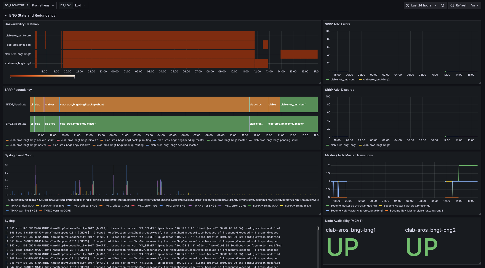
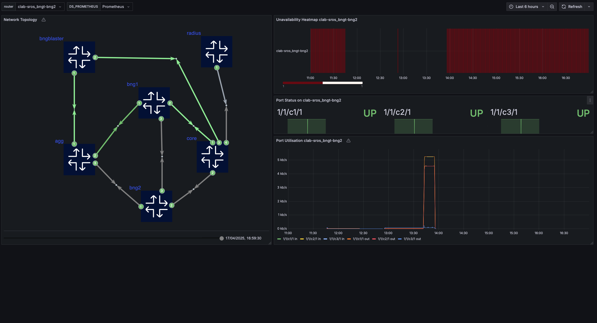

# SROS MAG-Integrated / BNG Observability Lab

# Introduction

## Overview
This repository contains `clab` that implements *MAG-Integrated (Multi-Access Gateway) / BNG (Broadband Network Gateway)* test-bed and collects telemetry, events and state data from a *BNG*, aggregation and core network elements via *SROS MDM* interfaces and syslog channels. For the sake of simplicity, we are going to refer to the *BNG* as a *MAG* in this document, as a term reflecting better the modern nature of this NE Function in a network. The lab is designed to be used for demonstration and testing purposes only. It is not intended to be used in production environments.
Our immediate objectives are to show how *MAG*  telemetry data can be collected and visualized using open-source tools such as `Prometheus`, `Grafana`, `Fluent Bit`, `Loki`, `gNMIc`, `Smokeping` and `Alertmanager`. The lab also includes a *BNG Blaster*, which is a traffic generator that can be used to generate traffic on the *MAG*  devices. The lab is designed to be easy to use and can be deployed using `Containerlab`.
The goal is to create a simple observability concept solution for *MAG*  devices that can be used in lab environments and testbeds.
For the full-blown solution please refer to the official Nokia representatives.

|  |  |
|----------------------------------------|----------------------------------------|
|  |  |

Let's move step by step via the principle and pillars, since every endeavor should start with a plan and vision behind.

## Authors

[Kivanc Imer](mailto:kivanc.imer@nokia.com) - IP Solution Architect

[Anton Zyablov](mailto:anton.zyablov@nokia.com) - Solution Architects Lead

## Software Versions

| Software    | Version  |
|-------------|----------|
| Nokia SROS  | 24.7.R1  |
| gnmic       | 0.39.1   |
| bngblaster  | 0.9.17   |
| fluent-bit  | 3.2.10   |
| prometheus  | 2.53.4  |
| grafana     | 11.5.2   |
| freeradius-server | 3.2.3 |
| syslog-ng | 4.8.1-r1-ls153 |
| promtail |  3.4.3 |
| loki | 3.4.2 |
| alertmanager | 0.28.1 |
| smokeping_prober | 0.9.0 |


## Requirements

To run this clab, you need to have the following installed:
- [Docker](https://docs.docker.com/get-docker/)
- [Containerlab](https://containerlab.dev/getting-started/installation/)

Additional licenses and API tokens:
- *SROS* images (vr-sros should obtained from official Nokia representatives).
- *SROS* license is required to run the *SROS* containers (should obtained from official Nokia representatives).
- *Telegram API* token is required to send messages to a Telegram channel [Telegram Bots Tutorial](https://core.telegram.org/bots/tutorial).

# What is Observability?

## Observability vs Monitoring

Not the same as monitoring (practically collection and visualisation), so the aim of this setup is to provide observability of the *MAG*  devices and the network elements connected to it. Observability is a measure of how well internal states of a system can be inferred from knowledge of its external outputs. In other words, observability is the ability to understand what is happening inside a system based on the data that is available from outside the system. Collection of everything creates a mess and makes observation and troubleshooting hard.

Our magic formula would be the following:

**Observability** = **real-time monitoring of relevant metrics and states** + **context-rich dashboards** + **proactive view**. 

## What Should I Collect?

The observability stack should be able to collect the following data:
- Metrics or Telemetry: performance, resource usage, and other operational metrics.
- State Data: very important to create a rich-context, like what's subscriber IP@ now, redundancy state, etc.
- Logs: *NE* logs to trace the events and errors.
- Synthetic monitoring: execute *OAM* to measure performance of relevant services.

## Why do we need it?

- Faster Root Cause Analysis: quick identification and resolution performance issues.
- Higher Productivity: automation of collection and analysis tasks for network operations teams.
- Improved User Experience: catch and fix problems before it affects users.
- Better Capacity Planning: understanding of network usage patterns and trends.
- Enhanced Security: detection of anomalies and potential security threats.

While many of them are quite obvious, implementation may be not that easy.

## The three pillars of Observability 

### Logs

Records of events (often human-readable text) with timestamps.
They are easy to generate and read. Provide granular details of events or transactions.
Enable retrospective replay of incidents and can reveal errors/exceptions.

***MAG use-case applicability:*** Practically it's our syslog messages, which are collected from the *NE* devices and sent to the syslog server. 


### Metrics and State

Numerical measurements (e.g., CPU/memory usage, response times) that track system health over time. They are usually aggregated and stored in time-series databases.
Great for detecting trends and setting alert thresholds.
Offer a high-level view of performance (e.g., error rates, latency).

***MAG use-case applicability:*** In case of network streaming telemetry we should consider sample and on-change depends on a semantic of the metric. Apart from that the state data is also important to collect, since it provides a context for the metrics. For example, if you have a saturation for the particular subscriber, you may want to know what was an IP address or the state of the *MAG*  or link state.

### Traces

End-to-end records of a single request’s journey through a distributed system.
Ideal for pinpointing bottlenecks in complex, microservices-based workflows.
Provide context-specific details (e.g., which user made a request).
Help debug distributed systems by correlating requests across different services.


***MAG use-case applicability:*** Has this something to do with *MAG* ? At the first glance no, but if we look deeper and start considering the whole network and distributed system, which is the case, then things like traffic path, apprearance of subcriber on the different NEs with relevant state and metrics data could be considered as a trace.

#  Alerting pillars of BNG

What are the best practices to alert?
Well, let's not reinvent a wheel again, since we have quite nice guidelines and best practices from  Niall Richard Murphy, Betsy Beyer, Chris Jones, Jennifer Petoff [Site Reliability Engineering](https://learning.oreilly.com/library/view/site-reliability-engineering/9781491929117/).
Let's summarise here some key technical and operational aspects of the alerting process:

1. Alert on the data (state and metrics) from *MAG*  devices, CORE and Aggregation layer routers connected to Fixed Access NEs:
   - High CPU usage and memory usage.
   - High latency: reach out an *NE*.
   - Links saturation.
   - High packet loss: synthetics tests, *OAM*.
   - High number of error / dropped packets on interfaces.
   - High number of errors in logs.
   - Unexpected grow or drop in number sessions.
   - Approaching capacity / scalability limits.
   - Multi-chassis state and loss or redundancy between *OLT* and Aggregation routers.
   - Unexpected changes in number of routes.
   - Fluctuations on upstream *BGP* peering.
   - General criteria applicable to modern *IP/MPLS* networks.
2. Alerts should be real: it should not be a false positive or a false negative.
3. Alerts should be urgent: it should be sent to the right people at the right time.
4. Alerts should be actionable: it should provide enough information to help the operator understand the issue and take appropriate action.
5. Alerts should be clear: it should be easy to understand and interpret.

# BNG Observability (HOWTO)

## Observability Stack

Let's first consider metrics, not the state. The data path is quite standard `gNMIc` => `Prometheus` => `Grafana` with sample and on-change *gNMI* telemetry subscriptions.
The state data is collected in different ways. If the state is binary and easy to convert to the `(0|1)` metric and passed as time series data via `Prometheus`.
For example, the oper-state of the interface can be converted to `0` or `1` via gnmic event processors and passed to Prometheus.
```yaml
processors:
  oper-state-to-int:
    event-strings:
      value-names:
        - ".*"
      transforms:
        - replace:
            apply-on: "value"
            old: "up"
            new: "1"
        - replace:
            apply-on: "value"
            old: "down"
            new: "0"
```
Full gnmic configuration file to collect telemetry => [gnmic-metrics.yml](clab/sros_bng_observability/configs/gnmic/gnmic-metrics.yml)

In case we are talking about somehing like *SRRP* state or *IPv4/IPv6* address it takes another way: `gNMIc` => `Fluent Bit` => `Loki` => `Grafana`.
The corresponding `gnmic` configs can be found below:
```yaml
# Definitions of subscriptions
subscriptions:
  sros-sub-mgmt-subscribers-on-change:
    <<: *mode_stream_on_change
    paths:
      - "/state/subscriber-mgmt/subscriber[subscriber-id=*]/sla-profile-instance[id=*]/session[id=*][type=ppp]/ipv4/ip-address/address"
      - "/state/subscriber-mgmt/subscriber[subscriber-id=*]/sla-profile-instance[id=*]/session[id=*][type=ppp]/ipv6/dhcp6-lease/client-address"
      - "/state/subscriber-mgmt/subscriber[subscriber-id=*]/sla-profile-instance[id=*]/session[id=*][type=ppp]/ipv6/pd/ip-prefix/prefix"
      - "/state/subscriber-mgmt/subscriber[subscriber-id=*]/sla-profile-instance[id=*]/session[id=*][type=ppp]/ipv6/slaac/address"
      - "/state/service/vprn[service-name=BNG-INTERNET]/subscriber-interface[interface-name=SUB]/group-interface[group-interface-name=GRP_1]/srrp[srrp-id=*]/oper-state"
      - "/state/service/vprn[service-name=BNG-INTERNET]/subscriber-interface[interface-name=SUB]/group-interface[group-interface-name=GRP_1]/srrp[srrp-id=*]/master-since"

  
  sros-sub-mgmt-subscribers-sample:
    <<: *mode_stream_sample
    paths:
      - "/state/subscriber-mgmt/subscriber[subscriber-id=*]/sla-profile-instance[id=*]/session[id=*][type=ppp]/ipv4/ip-address/address"
      - "/state/subscriber-mgmt/subscriber[subscriber-id=*]/sla-profile-instance[id=*]/session[id=*][type=ppp]/ipv6/dhcp6-lease/client-address"
      - "/state/subscriber-mgmt/subscriber[subscriber-id=*]/sla-profile-instance[id=*]/session[id=*][type=ppp]/ipv6/pd/ip-prefix/prefix"
      - "/state/subscriber-mgmt/subscriber[subscriber-id=*]/sla-profile-instance[id=*]/session[id=*][type=ppp]/ipv6/slaac/address"
      - "/state/service/vprn[service-name=BNG-INTERNET]/subscriber-interface[interface-name=SUB]/group-interface[group-interface-name=GRP_1]/srrp[srrp-id=*]/oper-state"
      - "/state/service/vprn[service-name=BNG-INTERNET]/subscriber-interface[interface-name=SUB]/group-interface[group-interface-name=GRP_1]/srrp[srrp-id=*]/master-since"
```
Again sample and on-change remains relevant too, since we definitely should be aware when the state has been changed. 
Sampling is required to and ensure the state is periodically verified for observability purposes and always present on the grafana dashboards in case an interval is a few minutes only.
The full `gnmic` configuration file to collect the state data => [gnmic-state.yml](clab/sros_bng_observability/configs/gnmic/gnmic-state.yml)

The logs are collected via `syslog-ng` and sent to `Fluent Bit`, which is then sent to `Loki`. Such path is dictated by the need to convert [RFC3164](https://www.rfc-editor.org/rfc/rfc3164) syslog messages into [RFC5424](https://www.rfc-editor.org/rfc/rfc5424) format, which is required by `Fluent Bit`, which is in the next turn feed it toward `Loki`.

Availability monitoring is implemented via `ICMP`: `Smokeping` => `Prometheus` => `Grafana`. For now we are covering *MGMT* interface availability only.
The `Smokeping` server is configured to ping the *MAG*  devices and the aggregation device. The results are sent to `Prometheus`, which is then visualized in `Grafana`.
Apart from that additional alerting rules and Heatmap were added to verify if `NEs` are available via *gNMI MDM* interface.
Alerting rules are configured to send alerts to the `Alertmanager` server, which is then sent to the Telegram channel (check for the telegram token). 
This is done for the illustrative purposes and could be adjusted per need and requirements relatively easily.

As *NetOps* and *DevOps* pracititioners we should consider limits and scalability of the solution. The current setup is designed to be scalable and can be easily extended to support more devices and services.
But we should remember about limits on *NE* side to support number of subscriptions and number of sessions. The telemetry stack scaling should be cosidered as well as more network elements and data is been colleceted.
This is especially relevant *MAG*  where you can't simply pull everything for hundreds of thousands of subscribers at the same time, but we are going to discuss it in the next session in a bit greater detail.

## What and Why to collect?

| Component                        | XPath                                                                                                                                                                                                                                                                                                                                                                                                                                                                                                                                                                                                                                                                                                                                                                                                                                                                                                                                                                                                     | Notes                                                                                                                                                                                                                                                                                                                                                       |
|----------------------------------|-----------------------------------------------------------------------------------------------------------------------------------------------------------------------------------------------------------------------------------------------------------------------------------------------------------------------------------------------------------------------------------------------------------------------------------------------------------------------------------------------------------------------------------------------------------------------------------------------------------------------------------------------------------------------------------------------------------------------------------------------------------------------------------------------------------------------------------------------------------------------------------------------------------------------------------------------------------------------------------------------------------|-------------------------------------------------------------------------------------------------------------------------------------------------------------------------------------------------------------------------------------------------------------------------------------------------------------------------------------------------------------|
| CPU                              | - `/state/system/cpu[sample-period=60]/summary/usage`                                                                                                                                                                                                                                                                                                                                                                                                                                                                                                                                                                                                                                                                                                                                                                                                                                                                                                                                                        |                                                                                                                                                                                                                                                                                                                                                             |
| Memory                           | - `/state/system/memory-pools/summary/available-memory`<br>- `/state/system/memory-pools/summary/current-total-size`<br>- `/state/system/memory-pools/summary/total-in-use`                                                                                                                                                                                                                                                                                                                                                                                                                                                                                                                                                                                                                                                                                                                                                                                                                                     | Memory usage is calculated as %<br>Memory usage depends on the application (e.g., *RR* has high memory consumption)<br>Alert when above 90%                                                                                                                                                                                                                   |
| *PPP* Session                      | - `/state/subscriber-mgmt/statistics/sessions[counter=ppp-sessions-total-established]/current-value`<br>- `/state/subscriber-mgmt/statistics/total-hosts[counter=ipv4]`<br>- `/state/subscriber-mgmt/statistics/total-hosts[counter=ipv6]`                                                                                                                                                                                                                                                                                                                                                                                                                                                                                                                                                                                                                                                                                                                                                                      | Important to monitor. Too much fluctuation would point to a problem.                                                                                                                                                                                                                                                                                        |
| Hardware<br>Resources            | - `/state/card[slot-number=1]/fp[fp-number=1]/resource-usage/egress-queues`<br>- `/state/card[slot-number=1]/fp[fp-number=1]/resource-usage/ingress-policers`<br>- `/state/card[slot-number=1]/mda[mda-slot=1]/resource-usage/sap-instances`<br>- `/state/system/resource-usage/subscriber-next-hop-entries`                                                                                                                                                                                                                                                                                                                                                                                                                                                                                                                                                                                                                                                                                                     | Important to monitor in scaled deployments.<br>Depleted resource can indicate a configuration error or that *MAG*  has reached its capacity.<br>Since additional capacity deployment takes time, monitor its trajectory and implications for deployment plans. Resource depletion means no new subscriber sessions.                                             |
| *SRRP*                             | - `/state/service/vprn[service-name=BNG-INTERNET]/subscriber-interface[interface-name=SUB]/group-interface[group-interface-name=GRP_1]/srrp[srrp-id=1]/statistics/advertisement-interval-errors`<br>- `/state/service/vprn[service-name=BNG-INTERNET]/subscriber-interface[interface-name=SUB]/group-interface[group-interface-name=GRP_1]/srrp[srrp-id=1]/statistics/advertisement-interval-discards`<br>- `/state/service/vprn[service-name=BNG-INTERNET]/subscriber-interface[interface-name=SUB]/group-interface[group-interface-name=GRP_1]/srrp[srrp-id=1]/statistics/master-changes`<br>- `/state/service/vprn[service-name=BNG-INTERNET]/subscriber-interface[interface-name=SUB]/group-interface[group-interface-name=GRP_1]/srrp[srrp-id=1]/statistics/become-master`<br>- `/state/service/vprn[service-name=BNG-INTERNET]/subscriber-interface[interface-name=SUB]/group-interface[group-interface-name=GRP_1]/srrp[srrp-id=1]/statistics/become-non-master` | It is important to know which *MAG*  is active for each *Group Interface*, especially when each *MAG*  acts as master for half of the *Group Interfaces* (active/active redundancy).                                                                                                                                                                                  |
| Port and Interface<br>Statistics | - `/state/router[router-name=*]/interface[interface-name=*]/statistics/ip/in-octets`<br>- `/state/router[router-name=*]/interface[interface-name=*]/statistics/ip/out-octets`<br>- `/state/router[router-name=*]/interface[interface-name=*]/statistics/mpls/in-octets`<br>- `/state/router[router-name=*]/interface[interface-name=*]/statistics/mpls/out-octets`<br>- `/state/port[port-id=*]/ethernet/statistics/in-octets`<br>- `/state/port[port-id=*]/ethernet/statistics/out-octets`<br>- `/state/port[port-id=*]/ethernet/statistics/in-utilization`<br>- `/state/port[port-id=*]/ethernet/statistics/out-utilization`<br>- `/state/port[port-id=*]/oper-state`<br>- `/state/port[port-id=*]/ethernet/statistics/in-errors`<br>- `/state/port[port-id=*]/ethernet/statistics/out-errors`                                                                                                                                                                | Port and interface statistics are critical for monitoring, troubleshooting, and capacity planning.                                                                                                                                                                                                                                                           |
| Per Subscriber<br>Info           | - `/state/subscriber-mgmt/subscriber[subscriber-id=*]/sla-profile-instance[id=*]/session[type=ppp][id=*]/up-time`<br>- `/state/subscriber-mgmt/subscriber[subscriber-id=*]/sla-profile-instance[id=*]/session[type=ppp][id=*]/ipv4/forwarding-state`<br>- `/state/subscriber-mgmt/subscriber[subscriber-id=*]/sla-profile-instance[id=*]/session[type=ppp][id=*]/ipv6/pd/forwarding-state`<br>- `/state/subscriber-mgmt/subscriber[subscriber-id=*]/sla-profile-instance[id=*]/session[type=ppp][id=*]/ipv6/slaac/forwarding-state`<br>- `/state/subscriber-mgmt/subscriber[subscriber-id=*]/sla-profile-instance[id=*]/ingress/qos/statistics/out-profile-forwarded-octets`<br>- `/state/subscriber-mgmt/subscriber[subscriber-id=*]/sla-profile-instance[id=*]/egress/qos/statistics/out-exceed-profile-forwarded-octets`                                                                                                                                                 | Obtain detailed subscriber session and *QoS* information.                                                                                                                                                                                                                                                                                                    |

# MAG Setup

The topology below should repesent the *MAG*  testbed and it's key functional elements without observability stack since it's all living in the MGMT network.


The setup comprises two redundant **MAGs** serving a small number of simulated users in a straightforward network topology. The **AGG**, **MAGs**, and **CORE** routers all use **ISIS** for routing and **SR-MPLS** for tunneling.

**BNG Blaster** simulates subscribers by initiating dual-stack (**IPv4**/**IPv6**) **PPPoE** sessions. Subscriber traffic is transmitted to the **AGG** router via an **Access Interface**.

A service topology is depicted at the top of the diagram, employing a combination of **EVPN** and **L3VPN** services interconnected via **PXC**. On the **AGG** router, an **EVPN-VPLS** instance receives subscriber traffic and broadcasts **PPP** session initiation (**PADI**) requests to the **MAGs**.

The two **MAGs** function in an active/standby redundancy model. Only the active **MAG** responds to **PADI** messages. The redundancy mechanism is managed using the **SRRP** protocol, which elects the active **MAG**. Both **MAGs** are interconnected through a **Redundant Interface** running over the **MPLS** network. The **Redundant Interface** ensures that traffic can always reach the active **MAG**, even if the standby **MAG** receives downstream traffic due to transient network conditions or misconfigurations.

All session-related information (such as subscriber **Profiles**, **QoS settings**, and **DHCP leases**) is synchronized continuously to the standby **MAG**.

A **RADIUS** server provides the **AAA** (Authentication, Authorization, and Accounting) services. The active **MAG** authenticates incoming access requests with the **RADIUS** server, which responds with necessary attributes defining subscriber profiles and associated **DHCP Pool Names**. Upon successful authentication, the active **MAG** allocates session resources and coordinates with the **PPP client** to establish the session. IP address assignment is managed locally by the **DHCP Server** on the **MAG**.

Both **MAGs** advertise aggregated subscriber prefixes to the **CORE**. Prefix states are tracked using **SRRP**, enabling each **MAG** to determine its state (active or standby) for a given prefix. Routes advertised toward the **CORE** from the active **MAG** have a higher **BGP Local Preference** (150). In contrast, the standby **MAG** advertises routes with a standard local preference (100).

The **CORE** router manages upstream subscriber traffic and maintains a connection back to **BNG Blaster** to complete the loop. **BNG Blaster** receives traffic initially transmitted from the **Access Interface**.

## Key Components

The following components represent the primary functional and observability elements in the **MAG** testbed setup:
- **2 SROS MAG / BNG devices** We are using `bng1` and `bng2` as tragitional naming conventions here.
- **1 Aggregation device** (`agg`): Subscriber-side connectivity
- **1 Core device**: Manages upstream peering (e.g., High-Speed Internet services)
- **1 BNG Blaster**: Traffic generator simulating 10 dual-stack PPPoE IPv4/IPv6 subscriber sessions
- **1 Syslog server**: Aggregates logs and forwards them to Promtail
- **1 Promtail server**: Collects logs from Syslog and forwards to Loki
- **1 Loki server**: Aggregates log and state data
- **1 Prometheus server**: Stores and manages collected metrics
- **1 Grafana server**: Provides visualizations for monitoring and observability
- **1 Alertmanager server**: Manages alerts from Prometheus, capable of integration with Telegram for alert notifications
- **1 Fluent Bit server**: Collects device state data from gNMIc and forwards it to Loki
- **1 Smokeping server**: Gathers latency data and forwards it to Prometheus
- **1 gNMIc server**: Collects telemetry data from BNG devices and forwards it to Prometheus
- **1 gNMIc server**: Collects state data from BNG devices and forwards it to Fluent Bit
- **1 FreeRadius server**: Provides AAA (Authentication, Authorization, and Accounting) functionalities

# Getting Started

In order to bring up the lab execute `sudo clab deploy`.

```bash
❯ sudo clab deploy
15:23:47 INFO Containerlab started version=0.67.0
15:23:47 INFO Parsing & checking topology file=bngt.clab.yaml
15:23:47 INFO Pulling quay.io/prometheus/prometheus:v2.53.4 Docker image
15:23:52 INFO Done pulling quay.io/prometheus/prometheus:v2.53.4
15:23:52 INFO Pulling docker.io/grafana/promtail:3.4.3 Docker image
15:23:53 INFO Done pulling docker.io/grafana/promtail:3.4.3
15:23:53 INFO Pulling quay.io/prometheus/alertmanager:v0.28.1 Docker image
15:23:54 INFO Done pulling quay.io/prometheus/alertmanager:v0.28.1
15:23:54 INFO Pulling quay.io/superq/smokeping-prober:v0.9.0 Docker image
15:23:56 INFO Done pulling quay.io/superq/smokeping-prober:v0.9.0
15:23:56 INFO Creating lab directory path=/home/azyablov/clab/sros_bng_observability/clab-sros_bngt
15:23:56 INFO unable to adjust Labdir file ACLs: operation not supported
15:23:56 INFO node "tel-fb" is being delayed for 20 seconds
15:23:56 INFO node "gnmic-metrics" is being delayed for 40 seconds
15:23:56 INFO node "tel-am" is being delayed for 30 seconds
15:23:56 INFO node "tel-sping" is being delayed for 20 seconds
15:23:56 INFO node "tel-syslog" is being delayed for 10 seconds
15:23:56 INFO node "radius" is being delayed for 10 seconds
15:23:56 INFO node "tel-prom" is being delayed for 40 seconds
15:23:56 INFO node "tel-loki" is being delayed for 20 seconds
15:23:56 INFO node "tel-pt" is being delayed for 20 seconds
15:23:56 INFO node "tel-graf" is being delayed for 60 seconds
15:23:56 INFO node "gnmic-state" is being delayed for 30 seconds
15:23:56 INFO Using existing config file (/home/azyablov/clab/sros_bng_observability/clab-sros_bngt/bng1/tftpboot/config.txt) instead of applying a new one
15:23:56 INFO Using existing config file (/home/azyablov/clab/sros_bng_observability/clab-sros_bngt/bng2/tftpboot/config.txt) instead of applying a new one
15:23:56 INFO Using existing config file (/home/azyablov/clab/sros_bng_observability/clab-sros_bngt/agg/tftpboot/config.txt) instead of applying a new one
15:23:56 INFO Using existing config file (/home/azyablov/clab/sros_bng_observability/clab-sros_bngt/core/tftpboot/config.txt) instead of applying a new one
15:23:56 INFO Creating container name=core
15:23:56 INFO Creating container name=bng1
15:23:56 INFO Creating container name=bng2
15:23:56 INFO Creating container name=agg
15:23:56 INFO Adding public keys configuration node=clab-sros_bngt-bng2
15:23:56 INFO Created link: bng2:eth2 (1/1/2) ▪┄┄▪ core:eth2 (1/1/2)
15:23:56 INFO Waiting for node to be ready. This may take a while node=clab-sros_bngt-bng2 log="docker logs -f clab-sros_bngt-bng2"
15:23:57 INFO Created link: bng1:eth1 (1/1/1) ▪┄┄▪ agg:eth2 (1/1/2)
15:23:57 INFO Created link: bng1:eth2 (1/1/2) ▪┄┄▪ core:eth1 (1/1/1)
15:23:57 INFO Adding public keys configuration node=clab-sros_bngt-core
15:23:57 INFO Waiting for node to be ready. This may take a while node=clab-sros_bngt-core log="docker logs -f clab-sros_bngt-core"
15:23:57 INFO Created link: bng1:eth3 (1/1/3) ▪┄┄▪ bng2:eth3 (1/1/3)
15:23:57 INFO Created link: bng2:eth1 (1/1/1) ▪┄┄▪ agg:eth3 (1/1/3)
15:23:57 INFO Adding public keys configuration node=clab-sros_bngt-agg
15:23:57 INFO Adding public keys configuration node=clab-sros_bngt-bng1
15:23:57 INFO Waiting for node to be ready. This may take a while node=clab-sros_bngt-agg log="docker logs -f clab-sros_bngt-agg"
15:23:57 INFO Waiting for node to be ready. This may take a while node=clab-sros_bngt-bng1 log="docker logs -f clab-sros_bngt-bng1"
15:24:06 INFO Creating container name=radius
15:24:06 INFO Creating container name=tel-syslog
15:24:06 INFO Created link: radius:eth1 ▪┄┄▪ core:eth4 (1/1/4)
15:24:16 INFO Creating container name=tel-sping
15:24:16 INFO Creating container name=tel-fb
15:24:16 INFO Creating container name=tel-pt
15:24:16 INFO Creating container name=tel-loki
15:24:26 INFO Creating container name=tel-am
15:24:26 INFO Creating container name=gnmic-state
15:24:36 INFO Creating container name=gnmic-metrics
15:24:36 INFO Creating container name=tel-prom
15:24:56 INFO Creating container name=tel-graf
15:24:56 INFO node "bngblaster" is being delayed for 10 seconds
15:25:06 INFO Creating container name=bngblaster
15:25:06 INFO Created link: bngblaster:eth1 ▪┄┄▪ agg:eth1 (1/1/1)
15:25:06 INFO Created link: bngblaster:eth2 ▪┄┄▪ core:eth3 (1/1/3)
15:25:08 INFO Adding host entries path=/etc/hosts
15:25:08 INFO Adding SSH config for nodes path=/etc/ssh/ssh_config.d/clab-sros_bngt.conf
╭──────────────────────────────┬───────────────────────────────────────────────────────────────────┬─────────┬────────────────╮
│             Name             │                             Kind/Image                            │  State  │ IPv4/6 Address │
├──────────────────────────────┼───────────────────────────────────────────────────────────────────┼─────────┼────────────────┤
│ clab-sros_bngt-agg           │ nokia_sros                                                        │ running │ 172.20.20.21   │
│                              │ registry.srlinux.dev/pub/vr-sros:24.7.R1                          │         │ N/A            │
├──────────────────────────────┼───────────────────────────────────────────────────────────────────┼─────────┼────────────────┤
│ clab-sros_bngt-bng1          │ nokia_sros                                                        │ running │ 172.20.20.11   │
│                              │ registry.srlinux.dev/pub/vr-sros:24.7.R1                          │         │ N/A            │
├──────────────────────────────┼───────────────────────────────────────────────────────────────────┼─────────┼────────────────┤
│ clab-sros_bngt-bng2          │ nokia_sros                                                        │ running │ 172.20.20.12   │
│                              │ registry.srlinux.dev/pub/vr-sros:24.7.R1                          │         │ N/A            │
├──────────────────────────────┼───────────────────────────────────────────────────────────────────┼─────────┼────────────────┤
│ clab-sros_bngt-bngblaster    │ linux                                                             │ running │ 172.20.20.2    │
│                              │ azyablov/bng-blaster:latest                                       │         │ N/A            │
├──────────────────────────────┼───────────────────────────────────────────────────────────────────┼─────────┼────────────────┤
│ clab-sros_bngt-core          │ nokia_sros                                                        │ running │ 172.20.20.22   │
│                              │ registry.srlinux.dev/pub/vr-sros:24.7.R1                          │         │ N/A            │
├──────────────────────────────┼───────────────────────────────────────────────────────────────────┼─────────┼────────────────┤
│ clab-sros_bngt-gnmic-metrics │ linux                                                             │ running │ 172.20.20.42   │
│                              │ harbor.nice.nokia.net/ghcr/openconfig/gnmic:0.39.1                │         │ N/A            │
├──────────────────────────────┼───────────────────────────────────────────────────────────────────┼─────────┼────────────────┤
│ clab-sros_bngt-gnmic-state   │ linux                                                             │ running │ 172.20.20.41   │
│                              │ harbor.nice.nokia.net/ghcr/openconfig/gnmic:0.39.1                │         │ N/A            │
├──────────────────────────────┼───────────────────────────────────────────────────────────────────┼─────────┼────────────────┤
│ clab-sros_bngt-radius        │ linux                                                             │ running │ 172.20.20.111  │
│                              │ harbor.nice.nokia.net/docker/freeradius/freeradius-server:3.2.3   │         │ N/A            │
├──────────────────────────────┼───────────────────────────────────────────────────────────────────┼─────────┼────────────────┤
│ clab-sros_bngt-tel-am        │ linux                                                             │ running │ 172.20.20.35   │
│                              │ quay.io/prometheus/alertmanager:v0.28.1                           │         │ N/A            │
├──────────────────────────────┼───────────────────────────────────────────────────────────────────┼─────────┼────────────────┤
│ clab-sros_bngt-tel-fb        │ linux                                                             │ running │ 172.20.20.33   │
│                              │ cr.fluentbit.io/fluent/fluent-bit:3.2.10                          │         │ N/A            │
├──────────────────────────────┼───────────────────────────────────────────────────────────────────┼─────────┼────────────────┤
│ clab-sros_bngt-tel-graf      │ linux                                                             │ running │ 172.20.20.38   │
│                              │ grafana/grafana:11.5.2                                            │         │ N/A            │
├──────────────────────────────┼───────────────────────────────────────────────────────────────────┼─────────┼────────────────┤
│ clab-sros_bngt-tel-loki      │ linux                                                             │ running │ 172.20.20.34   │
│                              │ grafana/loki:3.4.2                                                │         │ N/A            │
├──────────────────────────────┼───────────────────────────────────────────────────────────────────┼─────────┼────────────────┤
│ clab-sros_bngt-tel-prom      │ linux                                                             │ running │ 172.20.20.37   │
│                              │ quay.io/prometheus/prometheus:v2.53.4                             │         │ N/A            │
├──────────────────────────────┼───────────────────────────────────────────────────────────────────┼─────────┼────────────────┤
│ clab-sros_bngt-tel-pt        │ linux                                                             │ running │ 172.20.20.32   │
│                              │ grafana/promtail:3.4.3                                            │         │ N/A            │
├──────────────────────────────┼───────────────────────────────────────────────────────────────────┼─────────┼────────────────┤
│ clab-sros_bngt-tel-sping     │ linux                                                             │ running │ 172.20.20.36   │
│                              │ quay.io/superq/smokeping-prober:v0.9.0                            │         │ N/A            │
├──────────────────────────────┼───────────────────────────────────────────────────────────────────┼─────────┼────────────────┤
│ clab-sros_bngt-tel-syslog    │ linux                                                             │ running │ 172.20.20.31   │
│                              │ harbor.nice.nokia.net/docker/linuxserver/syslog-ng:4.8.1-r1-ls153 │         │ N/A            │
╰──────────────────────────────┴───────────────────────────────────────────────────────────────────┴─────────┴────────────────╯
```


Then it's a time to let in your subscribers by running *BNG Blaster*, just execute following command:

```bash
docker exec -it clab-sros_bngt-bngblaster bash
```

Then, you can run the following command to generate traffic:
```bash
bngblaster -C pppoe.json -I -l dhcp
```

OR do it in one go:

```bash
docker exec -it clab-sros_bngt-bngblaster bash -c 'bngblaster -C pppoe.json -I -l dhcp'
```

Then you can perform SSH port forwarding to your remote machine toward ro connect locally to `clab-sros_bngt-tel-graf:3000` and voilà... your nice dashboards are ready to use.

# Dashboards Gallery

***_BNG State and Redundancy_***


***_BNG Resources_***


***_Core and Aggregation Network_***


***__Subscriber Inside__***


***__Traffic__***


