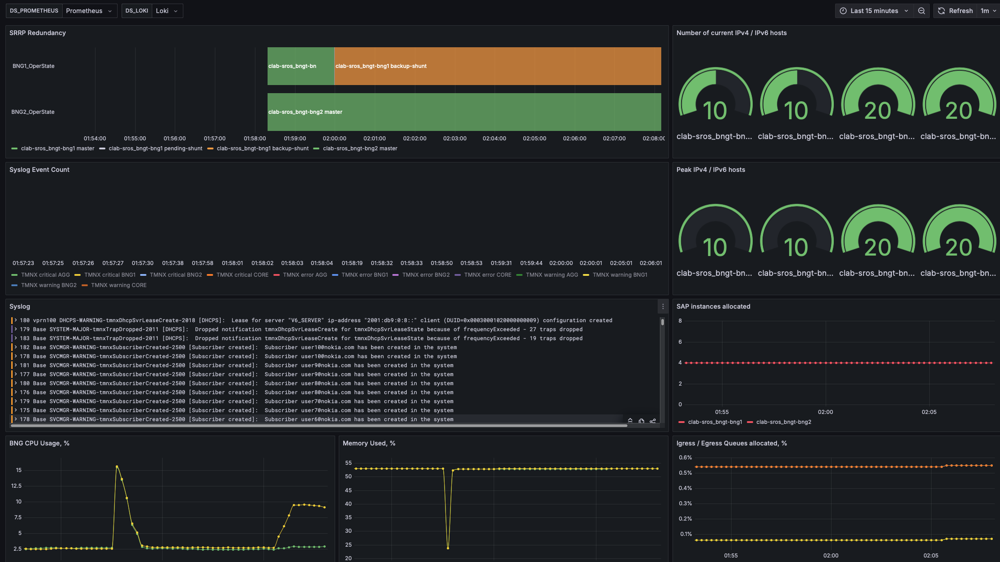
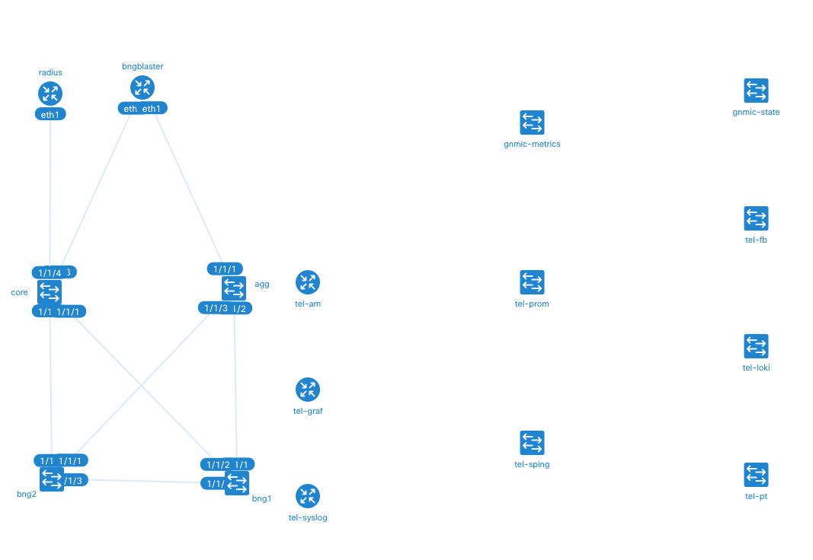

# SROS BNG Observability Lab

# Overview
This repository contains clab that collects telemetry, events and state data from a BNG (Broadband Network Gateway), aggregation and core via SROS MDM interfaces and syslog channels.




# Softare versions

SROS 24.7.R1
gNMIc 0.39.1

# Requirements

In order to run this clab, you need to have the following installed:
- [Docker](https://docs.docker.com/get-docker/)
- [Containerlab](https://containerlab.dev/getting-started/installation/)

Additional licenses and API tokens:
- SROS license is required to run the SROS containers.
- Telegram API token is required to send messages to a Telegram channel.

# Getting Started

In order to bring up the lab execute `sudo clab deploy`.
The following command will create a lab with the following nodes:
- 2 SROS BNG devices
- 1 Aggregation device
- 1 Core device
- 1 BNG Blaster: traffic generator
- 1 Syslog server
- 1 Loki server
- 1 Promtail server: takes logs from the syslog server and sends them to Loki
- 1 Prometheus server
- 1 Grafana server
- 1 Alertmanager server: if you have Telegram API token, you can send alerts to a Telegram channel
- 1 Fluent Bit server: collects state from gnmic and sends them to Loki
- 1 Smokeping server: collects latency data and sends them to Prometheus
- 1 gNMIc server: collects telemetry data from the BNG devices and sends them to Prometheus
- 1 gNMIc server: collects state data from the BNG devices and sends them to Fluent Bit
- 1 FreeRadius server

```bash
23:49:02 INFO Containerlab started version=0.67.0
23:49:02 INFO Parsing & checking topology file=bngt.clab.yaml
23:49:02 INFO Creating docker network name=bngt IPv4 subnet=172.20.20.0/24 IPv6 subnet="" MTU=0
23:49:02 INFO Creating lab directory path=/home/azyablov/clab/sros_bng_telemetry/clab-sros_bngt
23:49:02 INFO unable to adjust Labdir file ACLs: operation not supported
23:49:02 INFO node "tel-prom" is being delayed for 60 seconds
23:49:02 INFO node "tel-pt" is being delayed for 30 seconds
23:49:02 INFO node "tel-sping" is being delayed for 60 seconds
23:49:02 INFO node "tel-graf" is being delayed for 60 seconds
23:49:02 INFO node "gnmic-state" is being delayed for 120 seconds
23:49:02 INFO node "tel-fb" is being delayed for 30 seconds
23:49:02 INFO node "tel-syslog" is being delayed for 45 seconds
23:49:02 INFO node "tel-loki" is being delayed for 15 seconds
23:49:02 INFO node "gnmic-metrics" is being delayed for 60 seconds
23:49:02 INFO node "radius" is being delayed for 30 seconds
23:49:02 INFO node "tel-am" is being delayed for 60 seconds
23:49:02 INFO Using existing config file (/home/azyablov/clab/sros_bng_telemetry/clab-sros_bngt/bng2/tftpboot/config.txt) instead of applying a new one
23:49:02 INFO Using existing config file (/home/azyablov/clab/sros_bng_telemetry/clab-sros_bngt/bng1/tftpboot/config.txt) instead of applying a new one
23:49:02 INFO Using existing config file (/home/azyablov/clab/sros_bng_telemetry/clab-sros_bngt/agg/tftpboot/config.txt) instead of applying a new one
23:49:02 INFO Using existing config file (/home/azyablov/clab/sros_bng_telemetry/clab-sros_bngt/core/tftpboot/config.txt) instead of applying a new one
23:49:02 INFO Creating container name=agg
23:49:02 INFO Creating container name=core
23:49:02 INFO Creating container name=bng2
23:49:02 INFO Creating container name=bng1
23:49:03 INFO Created link: bng1:eth2 (1/1/2) ▪┄┄▪ core:eth1 (1/1/1)
23:49:03 INFO Created link: bng2:eth2 (1/1/2) ▪┄┄▪ core:eth2 (1/1/2)
23:49:03 INFO Created link: bng1:eth1 (1/1/1) ▪┄┄▪ agg:eth2 (1/1/2)
23:49:03 INFO Created link: bng2:eth1 (1/1/1) ▪┄┄▪ agg:eth3 (1/1/3)
23:49:03 INFO Adding public keys configuration node=clab-sros_bngt-agg
23:49:03 INFO Adding public keys configuration node=clab-sros_bngt-core
23:49:03 INFO Waiting for node to be ready. This may take a while node=clab-sros_bngt-agg log="docker logs -f clab-sros_bngt-agg"
23:49:03 INFO Waiting for node to be ready. This may take a while node=clab-sros_bngt-core log="docker logs -f clab-sros_bngt-core"
23:49:03 INFO Adding public keys configuration node=clab-sros_bngt-bng1
23:49:03 INFO Waiting for node to be ready. This may take a while node=clab-sros_bngt-bng1 log="docker logs -f clab-sros_bngt-bng1"
23:49:03 INFO Created link: bng1:eth3 (1/1/3) ▪┄┄▪ bng2:eth3 (1/1/3)
23:49:03 INFO Adding public keys configuration node=clab-sros_bngt-bng2
23:49:03 INFO Waiting for node to be ready. This may take a while node=clab-sros_bngt-bng2 log="docker logs -f clab-sros_bngt-bng2"
23:49:17 INFO Creating container name=tel-loki
23:49:32 INFO Creating container name=tel-fb
23:49:32 INFO Creating container name=tel-pt
23:49:32 INFO Creating container name=radius
23:49:32 INFO Created link: radius:eth1 ▪┄┄▪ core:eth4 (1/1/4)
23:49:47 INFO Creating container name=tel-syslog
23:50:02 INFO Creating container name=tel-prom
23:50:02 INFO Creating container name=tel-graf
23:50:02 INFO Creating container name=gnmic-metrics
23:50:02 INFO Creating container name=tel-sping
23:50:02 INFO Creating container name=tel-am
23:51:02 INFO Creating container name=gnmic-state
23:51:02 INFO node "bngblaster" is being delayed for 30 seconds
23:51:32 INFO Creating container name=bngblaster
23:51:32 INFO Created link: bngblaster:eth1 ▪┄┄▪ agg:eth1 (1/1/1)
23:51:32 INFO Created link: bngblaster:eth2 ▪┄┄▪ core:eth3 (1/1/3)
23:51:32 INFO Adding host entries path=/etc/hosts
23:51:33 INFO Adding SSH config for nodes path=/etc/ssh/ssh_config.d/clab-sros_bngt.conf
╭──────────────────────────────┬───────────────────────────────────────────────────────────────────┬─────────┬────────────────╮
│             Name             │                             Kind/Image                            │  State  │ IPv4/6 Address │
├──────────────────────────────┼───────────────────────────────────────────────────────────────────┼─────────┼────────────────┤
│ clab-sros_bngt-agg           │ nokia_sros                                                        │ running │ 172.20.20.21   │
│                              │ registry.srlinux.dev/pub/vr-sros:24.7.R1                          │         │ N/A            │
├──────────────────────────────┼───────────────────────────────────────────────────────────────────┼─────────┼────────────────┤
│ clab-sros_bngt-bng1          │ nokia_sros                                                        │ running │ 172.20.20.11   │
│                              │ registry.srlinux.dev/pub/vr-sros:24.7.R1                          │         │ N/A            │
├──────────────────────────────┼───────────────────────────────────────────────────────────────────┼─────────┼────────────────┤
│ clab-sros_bngt-bng2          │ nokia_sros                                                        │ running │ 172.20.20.12   │
│                              │ registry.srlinux.dev/pub/vr-sros:24.7.R1                          │         │ N/A            │
├──────────────────────────────┼───────────────────────────────────────────────────────────────────┼─────────┼────────────────┤
│ clab-sros_bngt-bngblaster    │ linux                                                             │ running │ 172.20.20.2    │
│                              │ azyablov/bng-blaster:latest                                       │         │ N/A            │
├──────────────────────────────┼───────────────────────────────────────────────────────────────────┼─────────┼────────────────┤
│ clab-sros_bngt-core          │ nokia_sros                                                        │ running │ 172.20.20.22   │
│                              │ registry.srlinux.dev/pub/vr-sros:24.7.R1                          │         │ N/A            │
├──────────────────────────────┼───────────────────────────────────────────────────────────────────┼─────────┼────────────────┤
│ clab-sros_bngt-gnmic-metrics │ linux                                                             │ running │ 172.20.20.42   │
│                              │ harbor.nice.nokia.net/ghcr/openconfig/gnmic:latest                │         │ N/A            │
├──────────────────────────────┼───────────────────────────────────────────────────────────────────┼─────────┼────────────────┤
│ clab-sros_bngt-gnmic-state   │ linux                                                             │ running │ 172.20.20.41   │
│                              │ harbor.nice.nokia.net/ghcr/openconfig/gnmic:latest                │         │ N/A            │
├──────────────────────────────┼───────────────────────────────────────────────────────────────────┼─────────┼────────────────┤
│ clab-sros_bngt-radius        │ linux                                                             │ running │ 172.20.20.111  │
│                              │ harbor.nice.nokia.net/docker/freeradius/freeradius-server:3.2.3   │         │ N/A            │
├──────────────────────────────┼───────────────────────────────────────────────────────────────────┼─────────┼────────────────┤
│ clab-sros_bngt-tel-am        │ linux                                                             │ running │ 172.20.20.35   │
│                              │ quay.io/prometheus/alertmanager:latest                            │         │ N/A            │
├──────────────────────────────┼───────────────────────────────────────────────────────────────────┼─────────┼────────────────┤
│ clab-sros_bngt-tel-fb        │ linux                                                             │ running │ 172.20.20.33   │
│                              │ cr.fluentbit.io/fluent/fluent-bit:latest                          │         │ N/A            │
├──────────────────────────────┼───────────────────────────────────────────────────────────────────┼─────────┼────────────────┤
│ clab-sros_bngt-tel-graf      │ linux                                                             │ running │ 172.20.20.38   │
│                              │ grafana/grafana:latest                                            │         │ N/A            │
├──────────────────────────────┼───────────────────────────────────────────────────────────────────┼─────────┼────────────────┤
│ clab-sros_bngt-tel-loki      │ linux                                                             │ running │ 172.20.20.34   │
│                              │ grafana/loki:latest                                               │         │ N/A            │
├──────────────────────────────┼───────────────────────────────────────────────────────────────────┼─────────┼────────────────┤
│ clab-sros_bngt-tel-prom      │ linux                                                             │ running │ 172.20.20.37   │
│                              │ quay.io/prometheus/prometheus:latest                              │         │ N/A            │
├──────────────────────────────┼───────────────────────────────────────────────────────────────────┼─────────┼────────────────┤
│ clab-sros_bngt-tel-pt        │ linux                                                             │ running │ 172.20.20.32   │
│                              │ grafana/promtail:latest                                           │         │ N/A            │
├──────────────────────────────┼───────────────────────────────────────────────────────────────────┼─────────┼────────────────┤
│ clab-sros_bngt-tel-sping     │ linux                                                             │ running │ 172.20.20.36   │
│                              │ quay.io/superq/smokeping-prober:latest                            │         │ N/A            │
├──────────────────────────────┼───────────────────────────────────────────────────────────────────┼─────────┼────────────────┤
│ clab-sros_bngt-tel-syslog    │ linux                                                             │ running │ 172.20.20.31   │
│                              │ harbor.nice.nokia.net/docker/linuxserver/syslog-ng:4.8.1-r1-ls153 │         │ N/A            │
╰──────────────────────────────┴───────────────────────────────────────────────────────────────────┴─────────┴────────────────╯
```

In order to run BNG Blaster, you need to run the following command:
```bash
docker exec -it clab-sros_bngt-bngblaster bash
```
Then, you can run the following command to generate traffic:
```bash
bngblaster -C pppoe.json -I -l dhcp
```

OR do it in one command:

```bash
docker exec -it clab-sros_bngt-bngblaster bash -c 'bngblaster -C pppoe.json -I -l dhcp'
```

Lab topology:




# Authors

[Kivanc Imer](mailto:kivanc.imer@nokia.com) IP Solution Architect

[Anton Zyablov](mailto:anton.zyablov@nokia.com) Solution Architects Lead


    